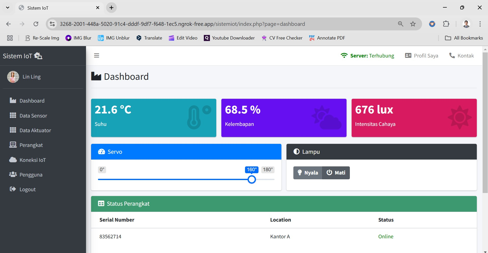
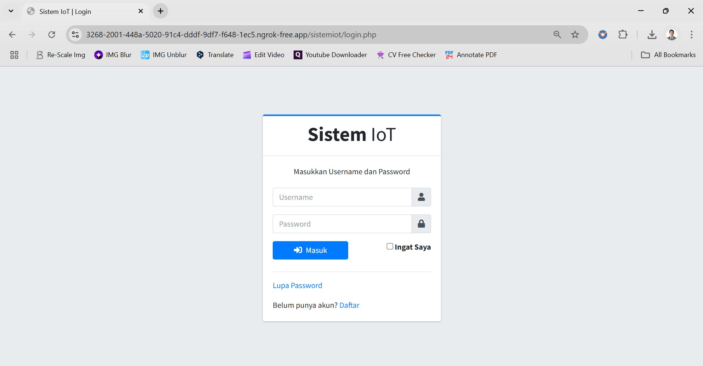
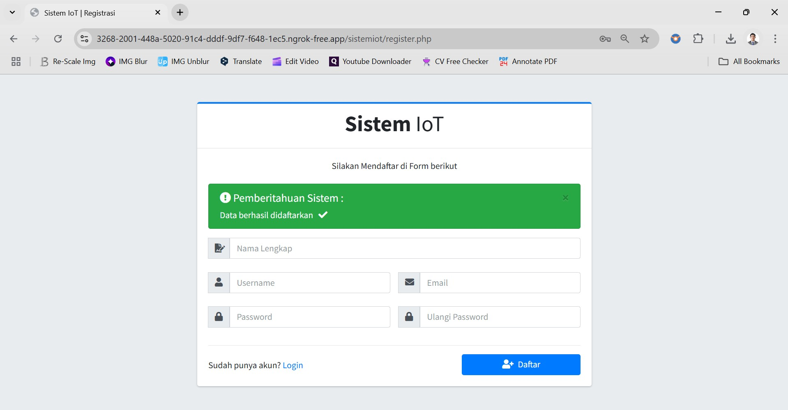

[](https://github.com/ellerbrock/open-source-badges/)
[](https://opensource.org/licenses/MIT)


# Implementasi-Dasar-Web-of-Things-Menggunakan-Private-Broker

Proyek berbasis Web ini dibuat untuk menangani sejumlah traffic pengguna dan device IoT. Proyek ini hanyalah contoh kecil dari implementasi Web of Things. Bagi pengguna, Web ini akan sangat membantu, utamanya dalam hal monitoring dan controlling. Selain itu juga ada fitur Data Logging di dalamnya. Mengenai fitur yang berhubungan dengan akun, koneksi, device, dan lain sebagainya juga telah dibuat seefisien mungkin sehingga diharapkan pengguna akan mudah beradaptasi dan nyaman dalam menggunakan Web ini.

<br>

## Project Requirements

| Part | Description |
| --- | --- |
| Fitur | • Publish<br>• Subscribe<br>• Buat<br>• Baca<br>• Ubah<br>• Hapus<br>• Paginasi<br>• Cari<br>• Validasi<br>• Cetak<br>• Ekspor<br>• DLL |
| Papan Pengembangan | DOIT ESP32 DEVKIT V1 |
| Editor Kode | • Arduino IDE<br>• Visual Studio Code |
| Dukungan Aplikasi | Laragon |
| Driver | CP210X USB Driver |
| Platform IoT | Shiftr.io |
| Protokol Komunikasi | • WebSocket Secure (WSS)<br>• Message Queuing Telemetry Transport (MQTT)<br>• Simple Mail Transfer Protocol (SMTP) |
| Arsitektur IoT | 3 Lapisan |
| Kerangka Kerja | AdminLTE v3.2.0 |
| Pustaka Web | • MQTT.js<br>• PHPMailer |
| Pustaka Arduino | • WiFi (bawaan)<br>• Servo<br>• DHT_sensor_library_for_ESPx<br>• Nusabot Simple Timer |
| Aktuator | • Motor Servo SG90 180° (x1)<br>• LED (x1)<br>• LED RGB (x1) |
| Sensor | • DHT22: Suhu & Kelembaban Udara (x1)<br>• LDR: Cahaya (x1) |
| Komponen Lainnya | • Kabel USB Mikro - USB tipe A (x1)<br>• Kabel jumper (1 set)<br>• Breadboard (x1)<br>• Resistor (x1) |

<br><br>

## Unduh & Instal

1. Arduino IDE

   <table><tr><td width="810">

   ```
   https://www.arduino.cc/en/software
   ```

   </td></tr></table><br>

2. CP210X USB Driver

   <table><tr><td width="810">

   ```
   https://bit.ly/CP210X_USB_Driver
   ```

   </td></tr></table><br>

3. Visual Studio Code

   <table><tr><td width="810">

   ```
   https://bit.ly/VScode_Installer
   ```

   </td></tr></table><br>

4. Laragon

   <table><tr><td width="810">

   ```
   https://laragon.org/download/
   ```

   </td></tr></table><br>

5. AdminLTE v3.2.0

   <table><tr><td width="810">

   ```
   https://codeload.github.com/ColorlibHQ/AdminLTE/zip/refs/tags/v3.2.0
   ```

   </td></tr></table>

<br><br>

## Rancangan Proyek

Segera Hadir...

<br><br>

## Pengaturan Arduino IDE
1. Buka ``` Arduino IDE ``` terlebih dahulu, kemudian buka proyek dengan cara klik ``` File ``` -> ``` Open ``` :

   <table><tr><td width="810">
      
      ``` kelasiotpemula_devancmw.ino ```

   </td></tr></table><br>
   
2. Isi ``` Url Pengelola Papan Tambahan ``` di Arduino IDE

   <table><tr><td width="810">
      
      Klik ``` File ``` -> ``` Preferences ``` -> masukkan ``` Boards Manager Url ``` dengan menyalin tautan berikut :
      
      ```
      https://dl.espressif.com/dl/package_esp32_index.json
      ```

   </td></tr></table><br>
   
3. ``` Pengaturan Board ``` di Arduino IDE

   <table>
      <tr><th width="810">

      Cara mengatur board ``` DOIT ESP32 DEVKIT V1 ```
            
      </th></tr>
      <tr><td>
      
      • Klik ``` Tools ``` -> ``` Board ``` -> ``` Boards Manager ``` -> Instal ``` esp32 ```.
   
      • Kemudian klik ``` Tools ``` -> ``` Board ``` -> ``` ESP32 Arduino ``` -> ``` DOIT ESP32 DEVKIT V1 ```.

      </td></tr>
   </table><br>
   
4. ``` Ubah Kecepatan Papan ``` di Arduino IDE

   <table><tr><td width="810">
      
      Klik ``` Tools ``` -> ``` Upload Speed ``` -> ``` 115200 ```

   </td></tr></table><br>
   
5. ``` Instal Pustaka ``` di Arduino IDE

   <table><tr><td width="810">
      
      Unduh semua file zip pustaka. Kemudian tempelkan di: ``` C:\Users\Computer_Username\Documents\Arduino\libraries ```

   </td></tr></table><br>

6. ``` Pengaturan Port ``` di Arduino IDE

   <table><tr><td width="810">
      
      Klik ``` Port ``` -> Pilih sesuai dengan port perangkat anda ``` (anda dapat melihatnya di Device Manager) ```

   </td></tr></table><br>

7. Ubah ``` Nama WiFi ```, ``` Kata Sandi WiFi ```, dan sebagainya sesuai dengan apa yang anda gunakan saat ini.<br><br>

8. Sebelum mengunggah program, silakan klik: ``` Verify ```.<br><br>

9. Jika tidak ada kesalahan dalam kode program, silakan klik: ``` Upload ```.<br><br>
    
10. Beberapa hal yang perlu anda lakukan saat menggunakan ``` board ESP32 ``` :

    <table><tr><td width="810">
       
       • Informasi ``` Arduino IDE ```: ``` Uploading... ``` -> segera tekan dan tahan tombol ``` BOOT ```.

       • Informasi ``` Arduino IDE ```: ``` Writing at .... (%) ``` -> lepaskan tombol ``` BOOT ```.

       • Tunggu sampai muncul pesan: ``` Done Uploading ``` -> ``` Program langsung dioperasikan ```.

       • Tekan tombol ``` EN (RST) ``` lalu ``` Restart ``` untuk menangani board ``` ESP32 ``` yang tidak bisa memproses ``` SC ```.

       • Jangan tekan tombol ``` BOOT ``` dan ``` EN ``` secara bersamaan karena hal ini bisa beralih ke mode ``` Unggah Firmware ```.

    </td></tr></table><br>

11. Jika masih ada masalah saat unggah program, maka coba periksa pada bagian ``` driver ``` / ``` port ``` / ``` yang lainnya ```.

<br><br>

## Pengaturan Private Broker

Segera Hadir...

<br><br>

## Pengaturan Ngrok

1. Ekstrak file, lalu pindahkan file ``` ngrok.exe ``` ke dalam folder -> ``` C:\laragon\www ```.<br><br>

2. Buka ``` ngrok.yml ``` -> lokasi: ``` C:\Users\[User Name]\AppData\Local\ngrok ```.<br><br>

3. Buat akun terlebih dahulu di Web: ``` ngrok.com ```. Kemudian cari ``` authtoken ``` dan ``` api_key ``` yang ada di Web tersebut, jika belum ada maka buatlah.<br><br> 

4. Salin dan Tempelkan ``` authtoken ``` dan ``` api_key ``` ke dalam sebuah file ``` ngrok.yml ```. Dan buatlah seperti yang terlihat di bawah ini :

   <table><tr><td width="810">
      
   ```yml 
   version: "3"
   agent:
     authtoken: [YOUR NGROK AUTHTOKEN]
     api_key: [YOUR NGROK API_KEY]
   tunnels:
     basic:
       proto: http
       addr: 80
       schemes: ["http", "https"]
   ````
   
   </td></tr></table><br>

5. Buka ``` ngrok.exe ```, lalu ketikkan perintah: 

   <table><tr><td width="810">
     
   ```bash 
   ngrok start --all 
   ```
   
   </td></tr></table><br>

6. Lalu ``` CTRL + Klik Link ``` yang ada -> lalu pilih ``` Visit Site ```.<br><br>

7. Pada ``` browser ``` anda tertera URL. Kemudian atur URL seperti berikut: ``` [URL Https NGROK]/sistemiot/ ```.
    
    • Contoh penulisan:

    <table><tr><td width="810">
   
    ```bash
    https://3268-2001-448a-5020-91c4-dddf-9df7-f648-1ec5.ngrok-free.app/sistemiot/
    ```
    
    </td></tr></table>

<br><br>

## Basis Data
1. Buka ``` Laragon ```, kemudian instal ``` phpMyAdmin ```. Cara instal: klik tombol ``` Menu ``` -> ``` Tools ``` -> ``` Quick add ``` -> ``` *phpmyadmin ```.<br><br>

2. Kemudian jika sudah, klik tombol ``` Start All ``` untuk memulai server secara lokal.<br><br>

3. Akses ``` peramban ``` terlebih dahulu untuk membuka panel admin basis data, silakan salin tautan berikut: ``` localhost/phpmyadmin/ ```.<br><br>
   
4. Buat basis data bernama ``` sistem_iot ``` di lokal.<br><br>

5. Buka basis data ``` sistem_iot ``` dan Impor ``` sistem_iot.sql ``` di direktori ``` sistemiot/dist/sql ```.

<br><br>

## Akun Bawaan
| Peran | Nama Pengguna | Kata Sandi |
| --- | --- | --- |
| Admin | linling | admin123 |
| User | albert | user123 |

<br><br>

## Get Started
1. Unduh dan ekstrak repositori ini.<br><br>

2. Pindahkan direktori ``` sistem_iot ``` ke dalam direktori laragon, yang rinciannya dapat anda lihat sebagai berikut: ``` C:\laragon\www ```. Direktori hasil ekstrak lainnya terserah anda.<br><br>
   
3. Pastikan anda memiliki komponen elektronik yang diperlukan.<br><br>
   
4. Pastikan komponen anda telah dirancang sesuai dengan diagram.<br><br>
   
5. Konfigurasikan perangkat anda menurut pengaturan di atas.<br><br>

6. Selamat menikmati [Selesai].

<br><br>

## Sorotan
<table>
<tr>
<th width="840">Dasbor</th>
</tr>
<tr>
<td></td>
</tr>
</table>
<table>
<tr>
<th width="420">Profil Admin</th>
<th width="420">Profil Pengguna</th>
</tr>
<tr>
<td></td>
<td></td>
</tr>
</table>
<table>
<tr>
<th width="420">Data Aktuator</th>
<th width="420">Data Sensor</th>
</tr>
<tr>
<td></td>
<td></td>
</tr>
</table>
<table>
<tr>
<th width="280">Tambah Perangkat</th>
<th width="280">Ubah Perangkat</th>
<th width="280">Hapus Perangkat</th>
</tr>
<tr>
<td></td>
<td></td>
<td></td>
</tr>
</table>
<table>
<tr>
<th width="280">Tambah Koneksi</th>
<th width="280">Ubah Koneksi</th>
<th width="280">Hapus Koneksi</th>
</tr>
<tr>
<td></td>
<td></td>
<td></td>
</tr>
</table>
<table>
<tr>
<th width="210">Tampilan Pengguna</th>
<th width="210">Tambah Pengguna</th>
<th width="210">Ubah Pengguna</th>
<th width="210">Hapus Pengguna</th>
</tr>
<tr>
<td></td>
<td></td>
<td></td>
<td></td>
</tr>
</table>
<table>
<tr>
<th width="210">Kode Sukses</th>
<th width="210">Kode Gagal</th>
<th width="210">Setel Ulang Email</th>
<th width="210">Setel Ulang Berhasil</th>
</tr>
<tr>
<td></td>
<td></td>
<td></td>
<td></td>
</tr>
</table>
<table>
<tr>
<th width="280">Masuk</th>
<th width="280">Pendaftaran</th>
<th width="280">Lupa Password</th>
</tr>
<tr>
<td></td>
<td></td>
<td></td>
</tr>
</table>

<br><br>

## Setel Ulang Increment Basis Data

<table><tr><td width="840">
   
```sql
SET  @num := 0;
UPDATE your_table SET id = @num := (@num+1);
ALTER TABLE your_table AUTO_INCREMENT =1;
```

</td></tr></table>

<br><br>

## Appreciation

Jika karya ini bermanfaat bagi anda, maka dukunglah karya ini sebagai bentuk apresiasi kepada penulis dengan mengklik tombol ``` ⭐Bintang ``` di bagian atas repositori.

<br><br>

## Penafian

Aplikasi ini merupakan hasil pengembangan dari Bootcamp Nusabot. Saya tidak memungkiri bahwa saya masih menggunakan layanan pihak ketiga dalam pengerjaan ini, antara lain: library, framework, dan lain sebagainya.

<br><br>

## LISENSI

LISENSI MIT - Hak Cipta © 2024 - Devan C. M. Wijaya, S.Kom

Dengan ini diberikan izin tanpa biaya kepada siapa pun yang mendapatkan salinan perangkat lunak ini dan file dokumentasi terkait perangkat lunak untuk menggunakannya tanpa batasan, termasuk namun tidak terbatas pada hak untuk menggunakan, menyalin, memodifikasi, menggabungkan, mempublikasikan, mendistribusikan, mensublisensikan, dan/atau menjual salinan Perangkat Lunak ini, dan mengizinkan orang yang menerima Perangkat Lunak ini untuk dilengkapi dengan persyaratan berikut:

Pemberitahuan hak cipta di atas dan pemberitahuan izin ini harus menyertai semua salinan atau bagian penting dari Perangkat Lunak.

DALAM HAL APAPUN, PENULIS ATAU PEMEGANG HAK CIPTA DI SINI TETAP MEMILIKI HAK KEPEMILIKAN PENUH. PERANGKAT LUNAK INI DISEDIAKAN SEBAGAIMANA ADANYA, TANPA JAMINAN APAPUN, BAIK TERSURAT MAUPUN TERSIRAT, OLEH KARENA ITU JIKA TERJADI KERUSAKAN, KEHILANGAN, ATAU LAINNYA YANG TIMBUL DARI PENGGUNAAN ATAU URUSAN LAIN DALAM PERANGKAT LUNAK INI, PENULIS ATAU PEMEGANG HAK CIPTA TIDAK BERTANGGUNG JAWAB, KARENA PENGGUNAAN PERANGKAT LUNAK INI TIDAK DIPAKSAKAN SAMA SEKALI, SEHINGGA RISIKO ADALAH MILIK ANDA SENDIRI.
