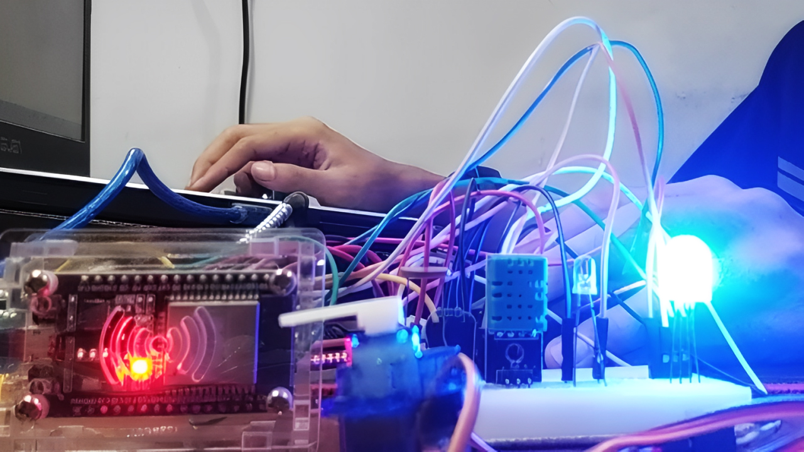
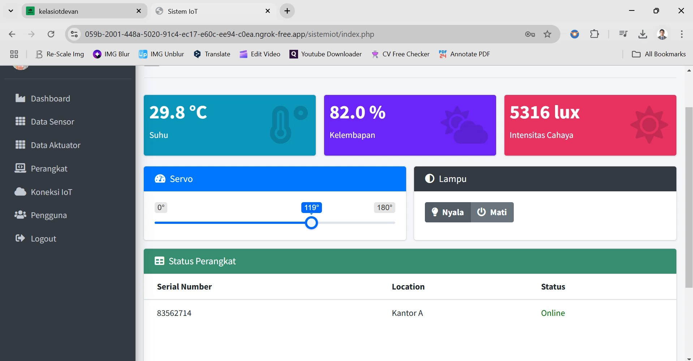
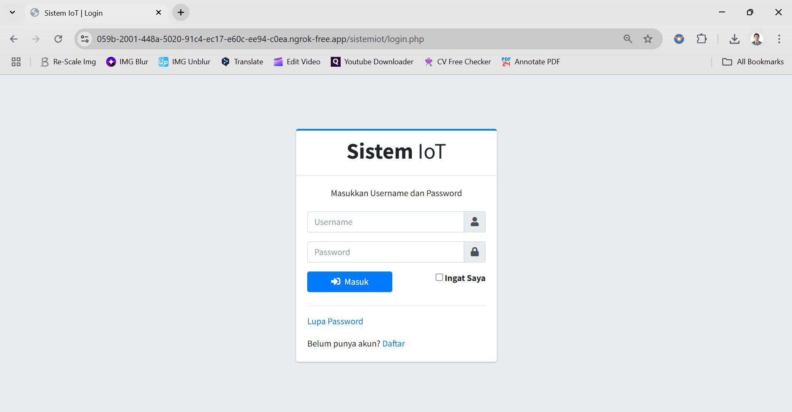
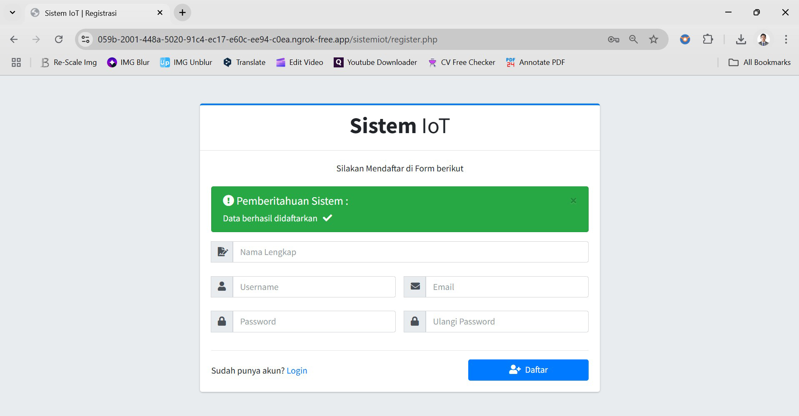

[](https://github.com/ellerbrock/open-source-badges/)
[](https://opensource.org/licenses/MIT)


# Implementasi-Dasar-Web-of-Things-Menggunakan-Private-Broker
This Web-based project was created to handle a number of user traffic and IoT devices. This project is just a small example of Web of Things implementation. For users, this Web will be very helpful, especially in terms of monitoring and controlling. In addition, there is also a Data Logging feature in it. Regarding features related to accounts, connections, devices, and so on have also been made as efficient as possible so that it is hoped that users will be adaptable and comfortable in using this Web.

<br>

## Project Requirements
| Part | Description |
| --- | --- |
| Features | • Publish<br>• Subscribe<br>• Create<br>• Read<br>• Update<br>• Delete<br>• Pagination<br>• Search<br>• Validation<br>• Print<br>• Export<br>• ETC |
| Development Board | DOIT ESP32 DEVKIT V1 |
| Code Editor | • Arduino IDE<br>• Visual Studio Code |
| Application Support | Laragon |
| Driver | CP210X USB Driver |
| IoT Platform | Shiftr.io |
| Communications Protocol | • WebSocket Secure (WSS)<br>• Message Queuing Telemetry Transport (MQTT)<br>• Simple Mail Transfer Protocol (SMTP) |
| IoT Architecture | 3 Layer |
| Framework | AdminLTE v3.2.0 |
| Web Library | • MQTT.js<br>• PHPMailer |
| Arduino Library | • WiFi (default)<br>• MQTT<br>• ESP32Servo<br>• DHT_sensor_library_for_ESPx<br>• Nusabot Simple Timer |
| Actuators | • Servo Motor SG90 180° (x1)<br>• LED (x1)<br>• RGB LED (x1) |
| Sensor | • DHT11: Air Temperature & Humidity (x1)<br>• LDR: Light Dependent Resistor (x1) |
| Other Components | • Micro USB cable - USB type A (x1)<br>• Jumper cable (1 set)<br>• Breadboard (x1)<br>• Resistor (x1) |

<br><br>

## Download & Install
1. Arduino IDE

   <table><tr><td width="810">

   ```
   https://www.arduino.cc/en/software
   ```

   </td></tr></table><br>

2. CP210X USB Driver

   <table><tr><td width="810">

   ```
   https://bit.ly/CP210X_USB_Driver
   ```

   </td></tr></table><br>

3. Visual Studio Code

   <table><tr><td width="810">

   ```
   https://bit.ly/VScode_Installer
   ```

   </td></tr></table><br>

4. Laragon

   <table><tr><td width="810">

   ```
   https://laragon.org/download/
   ```

   </td></tr></table><br>

5. AdminLTE v3.2.0

   <table><tr><td width="810">

   ```
   https://codeload.github.com/ColorlibHQ/AdminLTE/zip/refs/tags/v3.2.0
   ```

   </td></tr></table>

<br><br>

## Project Designs
<table>
<tr>
<th width="420">Block Diagram</th>
<th width="420">Pictorial Diagram</th>
</tr>
<tr>
<td></td>
<td></td>
</tr>
</table>
<table>
<tr>
<th width="840">Wiring</th>
</tr>
<tr>
<td></td>
</tr>
</table>

<br><br>

## Arduino IDE Setup
1. Open the ``` Arduino IDE ``` first, then open the project by clicking ``` File ``` -> ``` Open ``` : 

   <table><tr><td width="810">
   
      ``` kelasiotpemula_devancmw.ino ```

   </td></tr></table><br>
   
2. Fill in the ``` Additional Board Manager URLs ``` in Arduino IDE

   <table><tr><td width="810">
      
      Click ``` File ``` -> ``` Preferences ``` -> enter the ``` Boards Manager Url ``` by copying the following link :
      
      ```
      https://dl.espressif.com/dl/package_esp32_index.json
      ```

   </td></tr></table><br>
   
3. ``` Board Setup ``` in Arduino IDE

   <table>
      <tr><th width="810">

      How to setup the ``` DOIT ESP32 DEVKIT V1 ``` board
            
      </th></tr>
      <tr><td>
      
      • Click ``` Tools ``` -> ``` Board ``` -> ``` Boards Manager ``` -> Install ``` esp32 ```. 
      
      • Then selecting a Board by clicking: ``` Tools ``` -> ``` Board ``` -> ``` ESP32 Arduino ``` -> ``` DOIT ESP32 DEVKIT V1 ```.

   </td></tr></table><br>
   
4. ``` Change the Board Speed ``` in Arduino IDE

   <table><tr><td width="810">
      
      Click ``` Tools ``` -> ``` Upload Speed ``` -> ``` 115200 ```

   </td></tr></table><br>
   
5. ``` Install Library ``` in Arduino IDE

   <table><tr><td width="810">
      
      Download all the library zip files. Then paste it in the: ``` C:\Users\Computer_Username\Documents\Arduino\libraries ```

   </td></tr></table><br>

6. ``` Port Setup ``` in Arduino IDE

   <table><tr><td width="810">
      
      Click ``` Port ``` -> Choose according to your device port ``` (you can see in device manager) ```

   </td></tr></table><br>

7. Change the ``` WiFi Name ```, ``` WiFi Password ```, and so on according to what you are currently using.<br><br>

8. Before uploading the program please click: ``` Verify ```.<br><br>

9. If there is no error in the program code, then please click: ``` Upload ```.<br><br>
    
10. Some things you need to do when using the ``` ESP32 board ``` :

    <table><tr><td width="810">
       
      • ``` Arduino IDE ``` information: ``` Uploading... ``` -> immediately press and hold the ``` BOOT ``` button.

      • ``` Arduino IDE ``` information: ``` Writing at .... (%) ``` -> release the ``` BOOT ``` button.

      • Wait until the message appears: ``` Done Uploading ``` -> ``` The program is directly operated ```.

      • Press the ``` EN (RST) ``` button and then ``` Restart ``` to handle the ``` ESP32 ``` board that cannot process the ``` SC ```.

      • Do not press the ``` BOOT ``` and ``` EN ``` buttons at the same time as this may switch to ``` Upload Firmware ``` mode.

    </td></tr></table><br>

11. If there is still a problem when uploading the program, then try checking the ``` driver ``` / ``` port ``` / ``` others ``` section.

<br><br>

## Private Broker Setup
1. Create a Shiftr.io account at: ``` https://cloud.shiftr.io/welcome/sign-up ```.<br><br>

2. If so, login to your Shiftr.io account at: ``` https://cloud.shiftr.io/welcome/sign-in ```.<br><br>

3. Then, click the ``` Deploy Instance ``` button. Then set it as needed and click the ``` Deploy Instance ``` button.<br><br>

4. On the ``` Instance ``` menu, click the domain link provided.<br><br>

5. Then, click the ``` Sign In ``` button -> click the ``` Allow Request ``` button.<br><br>

6. Next, select the ``` Open Settings ``` button (the gear symbol at the bottom right).<br><br>

7. Select the ``` Tokens ``` menu -> click the ``` Create Token ``` button -> set it as needed and click the ``` Create ``` button.<br><br>

8. Select the ``` Webhooks ``` menu -> click the ``` Create Webhook ``` button -> set the ``` Topic ``` section according to what is in the .ino file and the Web created. In addition, you also need to set the ``` URL ``` section, change the URL to something like this: ``` [YOUR_NGROK_URL]/[YOUR_WEB_PROJECT] ``` -> click the ``` Create ``` button.

<br><br>

## Ngrok Setup
1. Extract the file, then move the file ``` ngrok.exe ``` into the folder -> ``` C:\laragon\www ```.<br><br>

2. Open ``` ngrok.yml ``` -> location: ``` C:\Users\[User Name]\AppData\Local\ngrok ```.<br><br>

3. First create an account on the Web: ``` ngrok.com ```. Then search for ``` authtoken ``` and ``` api_key ``` on the Web, if there is no one then create it.<br><br> 

4. Copy and Paste ``` authtoken ``` and ``` api_key ``` into a file ``` ngrok.yml ```. And create it as seen below :

   <table><tr><td width="810">
      
   ```yml 
   version: "3"
   agent:
     authtoken: [YOUR NGROK AUTHTOKEN]
     api_key: [YOUR NGROK API_KEY]
   tunnels:
     basic:
       proto: http
       addr: 80
       schemes: ["http", "https"]
   ````
   
   </td></tr></table><br>

5. Open ``` ngrok.exe ```, and then type the command: 

   <table><tr><td width="810">
     
   ```bash 
   ngrok start --all 
   ```
   
   </td></tr></table><br>

6. Then ``` CTRL + Click the Link ``` that is there -> then select ``` Visit Site ```.<br><br>

7. In your ``` browser ``` there is a URL. Then set the URL as follows: ``` [URL Https NGROK]/sistemiot/ ```.
    
    • Writing example:

    <table><tr><td width="810">
   
    ```bash
    https://3268-2001-448a-5020-91c4-dddf-9df7-f648-1ec5.ngrok-free.app/sistemiot/
    ```
    
    </td></tr></table>

<br><br>

## Database
1. Open ``` Laragon ```, then install ``` phpMyAdmin ```. How to install: click ``` Menu ``` button -> ``` Tools ``` -> ``` Quick add ``` -> ``` *phpmyadmin ```.<br><br>

2. Then if so, click ``` Start All ``` button to start the server locally.<br><br>

3. Access the browser first in order to open the database admin panel, please copy the following link: ``` localhost/phpmyadmin/ ```.<br><br>

4. Create a database called ``` sistem_iot ``` on local.<br><br>

5. Open the ``` sistem_iot ``` database and Import ``` sistem_iot.sql ``` in the ``` sistemiot/dist/sql ``` directory.

<br><br>

## Default Account
| Role | Username | Password |
| --- | --- | --- |
| Admin | linling | admin123 |
| User | albert | user123 |

<br><br>

## Get Started
1. Download and extract this repository.<br><br>
   
2. Move the ``` sistem_iot ``` directory into the laragon directory, whose details you can find out as follows: ``` C:\laragon\www ```. The rest of the extracted directory is up to you to place.<br><br>

3. Make sure you have the necessary electronic components.<br><br>
   
4. Make sure your components are designed according to the diagram.<br><br>
   
5. Configure your device according to the settings above.<br><br>

6. Please enjoy [Done].

<br><br>

## Highlights
<table>
<tr>
<th width="840">Device</th>
</tr>
<tr>
<td></td>
</tr>
</table>
<table>
<tr>
<th width="840">Dashboard</th>
</tr>
<tr>
<td></td>
</tr>
</table>
<table>
<tr>
<th width="420">Admin Profile</th>
<th width="420">User Profile</th>
</tr>
<tr>
<td></td>
<td></td>
</tr>
</table>
<table>
<tr>
<th width="420">Actuator Data</th>
<th width="420">Sensor Data</th>
</tr>
<tr>
<td></td>
<td></td>
</tr>
</table>
<table>
<tr>
<th width="280">Add Device</th>
<th width="280">Edit Device</th>
<th width="280">Delete Device</th>
</tr>
<tr>
<td></td>
<td></td>
<td></td>
</tr>
</table>
<table>
<tr>
<th width="280">Add Connection</th>
<th width="280">Edit Connection</th>
<th width="280">Delete Connection</th>
</tr>
<tr>
<td></td>
<td></td>
<td></td>
</tr>
</table>
<table>
<tr>
<th width="210">User View</th>
<th width="210">Add User</th>
<th width="210">Edit User</th>
<th width="210">Delete User</th>
</tr>
<tr>
<td></td>
<td></td>
<td></td>
<td></td>
</tr>
</table>
<table>
<tr>
<th width="210">Code Success</th>
<th width="210">Code Failed</th>
<th width="210">Email Reset</th>
<th width="210">Reset Success</th>
</tr>
<tr>
<td></td>
<td></td>
<td></td>
<td></td>
</tr>
</table>
<table>
<tr>
<th width="280">Login</th>
<th width="280">Register</th>
<th width="280">Forgot Password</th>
</tr>
<tr>
<td></td>
<td></td>
<td></td>
</tr>
</table>

<br><br>

## Reset Database Increment
<table><tr><td width="840">
   
```sql
SET  @num := 0;
UPDATE your_table SET id = @num := (@num+1);
ALTER TABLE your_table AUTO_INCREMENT =1;
```

</td></tr></table>

<br><br>

## Appreciation
If this work is useful to you, then support this work as a form of appreciation to the author by clicking the `⭐Star` button at the top of the repository.

<br><br>

## Disclaimer
This application is the result of the development of the Nusabot Bootcamp. I do not deny that I still use third-party services in this work, including: libraries, frameworks, and so on.

<br><br>

## LICENSE
MIT License - Copyright © 2024 - Devan C. M. Wijaya, S.Kom

Permission is hereby granted without charge to any person obtaining a copy of this software and the software-related documentation files to deal in them without restriction, including without limitation the right to use, copy, modify, merge, publish, distribute, sublicense, and/or sell copies of the Software, and to permit persons receiving the Software to be furnished therewith on the following terms:

The above copyright notice and this permission notice must accompany all copies or substantial portions of the Software.

IN ANY EVENT, THE AUTHOR OR COPYRIGHT HOLDER HEREIN RETAINS FULL OWNERSHIP RIGHTS. THE SOFTWARE IS PROVIDED AS IS, WITHOUT WARRANTY OF ANY KIND, EITHER EXPRESS OR IMPLIED, THEREFORE IF ANY DAMAGE, LOSS, OR OTHERWISE ARISES FROM THE USE OR OTHER DEALINGS IN THE SOFTWARE, THE AUTHOR OR COPYRIGHT HOLDER SHALL NOT BE LIABLE, AS THE USE OF THE SOFTWARE IS NOT COMPELLED AT ALL, SO THE RISK IS YOUR OWN.
